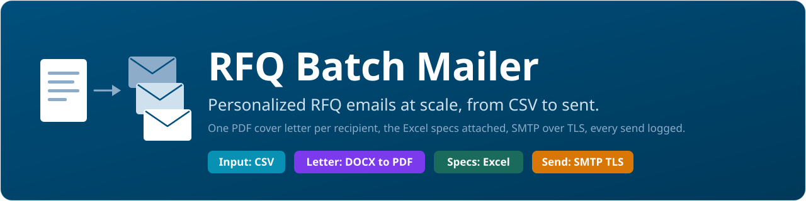

# jmvis-rfq-batch-mailer

[](https://github.com/jm-vis/jmvis-rfq-batch-mailer/releases)
[](https://github.com/jm-vis/jmvis-rfq-batch-mailer/blob/main/LICENSE)

Built and maintained by [VISCONSULT](https://vis-consult.eu), a consultancy in Germany that
applies AI in procurement, supply chain and operations. MIT licensed, Python, one script.

Send personalized RFQ emails with two attachments:
- A personalized cover letter (DOCX per recipient, converted to PDF)
- An Excel sheet with item specifications for price entry

The tool reads contacts from a CSV, personalizes the email body and cover letter, attaches the PDF and Excel, and sends via SMTP over TLS. It logs each send to a CSV and supports safe dry runs and one-click retries.

## Who is this for
- Non-technical users who need to send many RFQ emails consistently
- SMEs that want a simple, local, auditable workflow

## Features
- Personal greeting and company in the email
- DOCX cover letter templating with auto PDF
- Inline company logo in the email signature
- Delivery receipt requested where supported
- CSV logging with status, message ID, and error
- Retry from a previous log, up to 3 attempts per recipient
- Rate control via a short pause between emails

## Requirements
- Python 3.10+
- Windows or macOS: uses `docx2pdf` for PDF conversion
- Linux: LibreOffice required for PDF conversion (`soffice` on PATH)
- SMTP account (for example Microsoft 365, GMX). You need host, port, username, and password or an app password

## Installation
```bash
python -m venv .venv
# Windows
.\.venv\Scripts\activate
# macOS/Linux
source .venv/bin/activate

pip install --upgrade pip
pip install -r requirements.txt
````

## Quick start
1. Copy and edit configuration
   Copy `.env.example` to `.env` and fill your SMTP settings. Do not commit `.env`.

2. Place files in the project folder

* `contacts.csv` - recipients
* `cover_letter_template.docx` - letter template with placeholders
* `specifications.xlsx` - item list
* `email_body.html` - email body template
* `assets/logo.png` - inline logo for the signature

3. Dry run (no email sent)

```bash
python ./mass_mail.py --contacts ./contacts.csv --docx ./cover_letter_template.docx --xlsx ./specifications.xlsx --dry-run
```

4. Preview as .eml (no send)

```bash
python ./mass_mail.py --contacts ./contacts.csv --docx ./cover_letter_template.docx --xlsx ./specifications.xlsx --save-eml-out outbox --limit 1
```

Open the `.eml` in your mail client to check formatting and logo.

5. Send

```bash
python ./mass_mail.py --contacts ./contacts.csv --docx ./cover_letter_template.docx --xlsx ./specifications.xlsx
```

A log file `send_log_YYYYmmdd_HHMMSS.csv` is written to the project folder.

## Contacts CSV format
Header:

```csv
email,name,gender,company
```

* `gender` values: `m`, `f`, `x` (neutral greeting for `x`)

Example:

```csv
alice@example.com,Alice Carter,f,Carter Manufacturing LLC
bob@example.com,Bob Miller,m,Miller Tools Inc
alex@example.com,Alex Kim,x,AK Procurement
```

## Templates
Email template tokens in `email_body.html`:

* `{salutation}`, `{company}`, `{deadline}`, `{logo_cid}`

Cover letter tokens in `cover_letter_template.docx`:

* `{{ salutation }}`, `{{ company }}`, `{{ deadline }}`, `{{ from_name }}`, `{{ reply_to }}`, `{{ today }}`

## Configuration (.env)
Key options:

* `SMTP_HOST`, `SMTP_PORT`, `USE_SSL`
* `SMTP_USER`, `SMTP_PASSWORD`
* `FROM_NAME`, `REPLY_TO`
* `SUBJECT_TEMPLATE` (for example `RFQ for {company} - documents attached`)
* `DEADLINE`
* `EMAIL_BODY_HTML_TEMPLATE` (default `email_body.html`)
* `LOGO_PATH` (default `assets/logo.png`)
* `SLEEP_SECONDS` (default 1)
* `MAX_RETRIES` (default 3)
* `ATTACH_FORMAT` (`pdf` recommended)

Sample:

```dotenv
SMTP_HOST=mail.example.com
SMTP_PORT=587
USE_SSL=false
SMTP_USER=sender@example.com
SMTP_PASSWORD=CHANGE_ME

FROM_NAME=Your Name
REPLY_TO=reply@example.com

SUBJECT_TEMPLATE=RFQ for {company} - documents attached
DEADLINE=08/27/2025
EMAIL_BODY_HTML_TEMPLATE=email_body.html
LOGO_PATH=assets/logo.png
ATTACH_FORMAT=pdf
SLEEP_SECONDS=1
MAX_RETRIES=3
```

## Retry failed sends
Resend only failed addresses from a previous log. The total attempts per recipient are capped.

```bash
python ./mass_mail.py --retry-from-log send_log_YYYYmmdd_HHMMSS.csv --docx ./cover_letter_template.docx --xlsx ./specifications.xlsx
```

## Deliverability
* Prefer your own domain mailbox
* Set up SPF, DKIM, and DMARC for your domain
* Start with small batches and `SLEEP_SECONDS=1–2`

## Safety and privacy
* Do not commit `.env`
* Logs contain recipient data. Store securely
* Review attachments before sending

## Troubleshooting
* 535 auth error: wrong credentials, MFA or SMTP AUTH disabled
* Missing attachments: check file paths and names
* Hidden logo: mail client may block images by default

## What it does not do / Known gaps

- **One script, no test suite.** `mass_mail.py` is about 400 lines; there are no automated
  tests and no CI yet. Use the dry run and the `.eml` preview before every real send.
- **PDF conversion needs an office program.** On Windows and macOS `docx2pdf` drives
  Microsoft Word; on Linux it is LibreOffice. If the conversion fails, the script attaches
  the DOCX instead and does not stop, so check the preview for `Cover letter: ….pdf`.
- **No bounce handling.** The log records what the SMTP server accepted; bounces arrive in
  your mailbox later and are not read back.
- **Rate control is a pause, not a quota.** `SLEEP_SECONDS` spaces the sends; the limits of
  your mail provider still apply.

## About

This mailer was built for procurement work at [VISCONSULT](https://vis-consult.eu), a
consultancy in Germany. An RFQ round with many suppliers otherwise means copy, paste and
attach by hand; this script does the round from one CSV, one letter template and one
specification sheet, and leaves a log that can be checked afterwards. We publish it because
small purchasing teams run into the same problem.

Issues and pull requests are welcome here. If you want help with RFQ automation or with AI
in procurement, contact us through the website.

## License

MIT, see [LICENSE](LICENSE).
